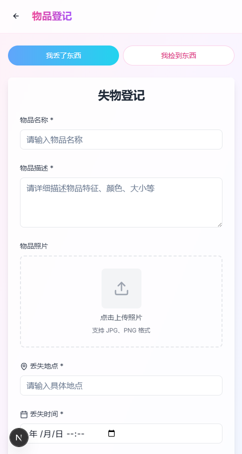
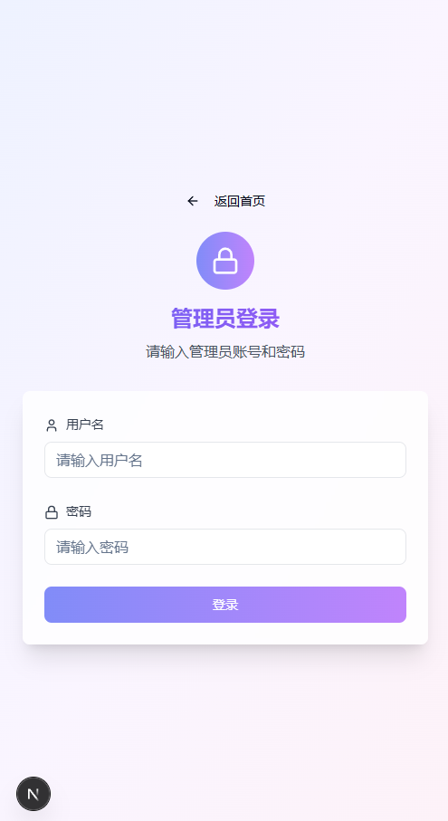
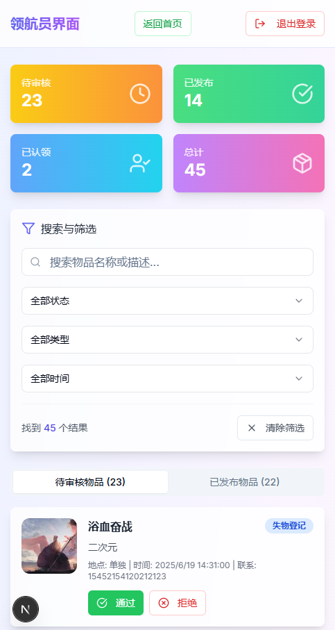

# 失物招领系统 🎯

一个现代化、可爱活泼风格的失物招领移动端前端应用，基于 Next.js 15 和 TypeScript 构建。

> 相关后端服务器 [Lost-Found-Hub](https://github.com/zouXH-god/Lost-Found-Hub)

<p align="center">
  
  
  
  
</p>

## ✨ 项目特色

### 🎨 设计风格
- **可爱活泼**：采用渐变色彩、圆角设计、柔和阴影
- **移动优先**：响应式布局，完美适配各种屏幕尺寸
- **现代UI**：毛玻璃效果、卡片式布局、流畅动画过渡

### 🚀 核心功能
- **失物招领**：管理员发布拾取物品，用户浏览查询
- **失物登记**：用户登记遗失物品，管理员审核发布
- **图片预览**：全屏模态框查看物品图片，支持缩放、旋转、拖拽
- **智能搜索**：多维度搜索和筛选功能
- **管理后台**：完整的管理员控制台，支持审核、统计、筛选

## 📱 页面结构

### 用户端
- **首页** (`/`) - 失物招领和失物登记列表展示
- **物品登记** (`/report`) - 失物/拾物报告表单

### 管理端
- **管理员登录** (`/admin`) - 身份验证页面
- **管理控制台** (`/admin/dashboard`) - 审核管理、数据统计

## 🛠️ 技术栈

### 前端框架
- **Next.js 15** - React 全栈框架
- **TypeScript** - 类型安全的 JavaScript
- **React 18** - 用户界面库

### UI 组件
- **Tailwind CSS** - 原子化 CSS 框架
- **shadcn/ui** - 高质量 React 组件库
- **Lucide React** - 精美的图标库
- **Radix UI** - 无障碍的底层组件

### 开发工具
- **ESLint** - 代码质量检查
- **Prettier** - 代码格式化
- **PostCSS** - CSS 处理工具

## 🚀 快速开始

### 环境要求
- Node.js 18.0 或更高版本
- npm 或 yarn 包管理器

### 安装步骤

1. **克隆项目**
   ```bash
   git clone <repository-url>
   cd lost-and-found-app
   ```

2. **安装依赖**
    ```bash
    npm install
    # 或
    yarn install
    ```
    
    3. **启动开发服务器**
    ```bash
    npm run dev
    # 或
    yarn dev
    ```

4. **访问应用**
   打开浏览器访问 [http://localhost:3000](http://localhost:3000)

### 构建生产版本
```bash
npm run build
npm start
```

## 📖 使用指南

### 用户操作
1. **浏览失物**：在首页查看已发布的失物招领和失物登记
2. **搜索物品**：使用搜索框快速查找相关物品
3. **登记失物**：点击浮动按钮填写失物信息
4. **查看图片**：点击缩略图在全屏模式下查看大图

### 管理员操作
1. **登录系统**：使用管理员账号登录（演示账号：admin/admin）
2. **审核物品**：在控制台审核待处理的物品信息
3. **管理状态**：标记物品为已认领状态
4. **数据筛选**：使用多种筛选条件快速定位物品

## 🎯 功能详解

### 图片预览系统
- **缩略图展示**：列表中显示物品缩略图
- **全屏预览**：点击后在全屏模态框中查看原图
- **交互操作**：
    - 鼠标滚轮缩放
    - 拖拽移动（放大状态下）
    - 双击重置
    - 旋转功能
    - 下载原图

### 管理员控制台
- **实时统计**：待审核、已发布、已认领、总计数据
- **多维筛选**：
    - 文本搜索：物品名称、描述、地点、联系方式
    - 状态筛选：待审核、已发布、已认领
    - 类型筛选：拾物报告、失物登记
    - 时间筛选：今天、本周、本月、自定义范围
- **批量操作**：审核通过、拒绝、标记认领

## 🔧 API 接口

项目基于提供的 OpenAPI 规范设计，主要接口包括：

### 认证接口
- `POST /api/auth/login` - 管理员登录

### 公共接口
- `GET /api/found-items` - 获取失物招领列表
- `GET /api/lost-items` - 获取失物登记列表
- `POST /api/report-lost` - 报告遗失物品
- `POST /api/report-found` - 报告拾获物品

### 管理员接口
- `GET /api/admin/pending-items` - 获取待审核物品
- `PUT /api/admin/approve-item/{id}` - 审核通过物品
- `PUT /api/admin/reject-item/{id}` - 拒绝物品
- `PUT /api/admin/mark-claimed/{id}` - 标记已认领

### 文件接口
- `POST /api/files/upload` - 上传文件
- `GET /api/files/{id}` - 获取文件（支持缩略图和原图）

## 🎨 自定义样式

### 主题色彩
- **粉色系**：失物招领相关功能
- **蓝色系**：失物登记相关功能
- **紫色系**：管理员功能
- **渐变背景**：营造温馨活泼的氛围

### 响应式设计
- **移动端优先**：针对手机屏幕优化
- **平板适配**：中等屏幕的良好体验
- **桌面端**：大屏幕的完整功能展示

## 🔒 安全特性

- **Token 认证**：管理员登录使用 JWT Token
- **路由保护**：管理员页面需要登录验证
- **输入验证**：表单数据的前端验证
- **XSS 防护**：安全的内容渲染

## 📱 浏览器兼容性

- Chrome 90+
- Firefox 88+
- Safari 14+
- Edge 90+
- 移动端浏览器

## 📄 许可证

本项目采用 MIT 许可证 - 查看 [LICENSE](LICENSE) 文件了解详情

## 🙏 致谢

- [Next.js](https://nextjs.org/) - React 框架
- [Tailwind CSS](https://tailwindcss.com/) - CSS 框架
- [shadcn/ui](https://ui.shadcn.com/) - UI 组件库
- [Lucide](https://lucide.dev/) - 图标库
- [Radix UI](https://www.radix-ui.com/) - 底层组件

## 📞 联系方式

如有问题或建议，欢迎提交 Issue

---

**让失物回家，让温暖传递** ❤️
